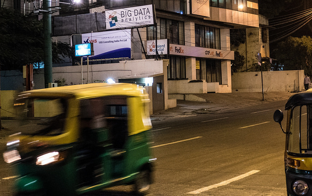
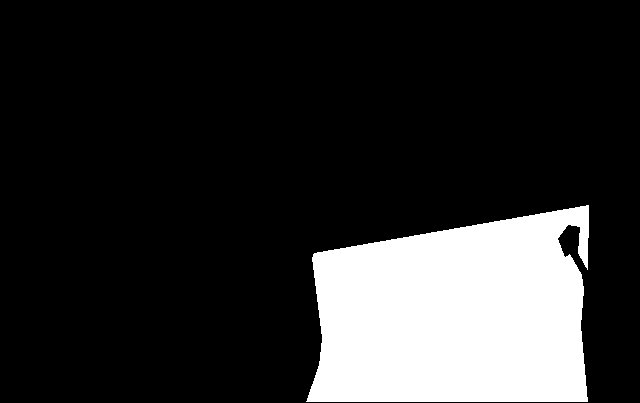
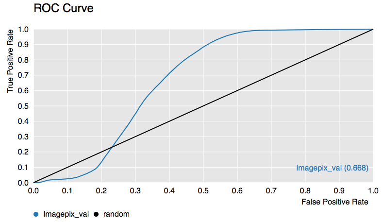
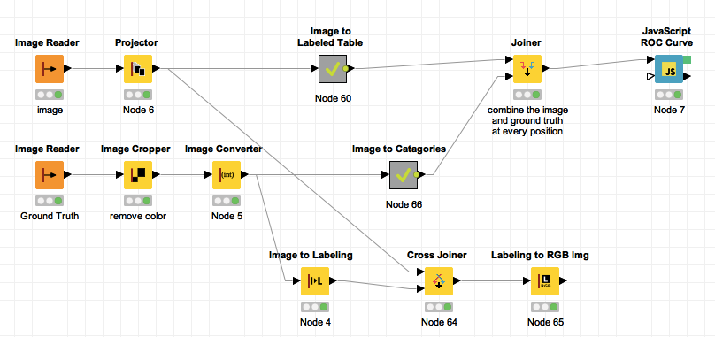

## Downloading the data
1. The data for the example can be downloaded from [here](https://github.com/kmader/Quantitative-Big-Imaging-Course/blob/master/Ex2/matlab.zip?raw=true)
2. Open the file in Archive Manager and extract the data to ```/scratch``` (only on D61.1 machines)

Many of these workflows are fairly complicated and would be time consuming to reproduce, follow the instructions [here](https://github.com/kmader/Quantitative-Big-Imaging-2016/wiki/KNIME-Setup#loading-workflows) for how to import a workflow from the zip files on this site


## Problems!
If you load a workflow and get an error message, click on the details button. If it says 'Node ... not available' it means you need to update your 'Image Processing Extensions' follow the instructions below to perform this update: [instructions](https://github.com/kmader/Quantitative-Big-Imaging-2016/wiki/KNIME-Setup#updating-to-the-latest-image-processing-extensions)

- If you cannot find the 'Salt and Pepper' node, this also means you are not using the latest Image Processing Extensions so update it as described above

## Getting Started
- Steps are shown in normal text, comments are shown in _italics_.

- Knime Basics: [here](https://github.com/kmader/Quantitative-Big-Imaging-2016/wiki/KNIME-Setup)

- Use workflow variables: [here](https://github.com/kmader/Quantitative-Big-Imaging-2016/wiki/KNIME-Setup#workflow-variables)

## Exploring ROC Curves

The task from the lecture of identifying the street  in the road . We thus have these data loaded in the workflow as the image and ground truth respectively.



The ROC curve's discussed in the last lecture we will use as a tool for evaluating our accuracy for the rest of the course. An example work-flow is below to generate the above curve.



Download the workflows [here](https://github.com/kmader/Quantitative-Big-Imaging-2016/blob/master/Exercises/04-files/ROCCurveSimple.zip?raw=true)

### Tasks
1. Where does filtering come into this workflow? 
 - Which filter elements might improve the area under the ROC?
 - Try making workflows to test out a few different filters
2. Where might morphological operations fit in?
 - How can you make them part of this workflow as well?
3. (Challenge) Use the ```Parameter Optimization Loop Start``` node to find the best filter size to maximize the ROC area


## Automatic Thresholding

The example takes on image of cells and simulates having a poor microscope, so we can test methods for performing thresholds even on very variable data.


Basic Workflow - [Automatic Thresholding](04-files/AutomaticThresholds.zip?raw=true)

1. Start KNIME (click OK for default workspace)
1. Import the above Workflow from an Archive
1. Right click the image reader to make sure it has downloaded, otherwise you can redownload the test image from here [Test Image](04-files/Cell_Colony.jpg?raw=true) and import it using the 'Image Reader' (make sure to remove the old one first)
1. Right click the 'Loop End' node and click 'Execute'
1. View the output and it (scroll left) should look like the following table


### Tasks

1. Try using different automatic threshold methods available in 'Global Threshold' to improve the results.
 - How will you quantify _improvement_
1. Would adding a filter improve the results? Where should it be added and why?
1. What other approaches could you use for segmenting images to get around the issue?
1. Try to adjust the parameters to get the final result


## Performing K-Means Analysis
In this example we use K-Means to automatically segment the images used in the second lecture


- Knime Workflow - [KMeans](04-files/KMeans-Demo.zip?raw=true)


1. Right click the image reader to make sure it has downloaded, otherwise you can redownload the test images from [here](https://github.com/kmader/Quantitative-Big-Imaging-Course/blob/master/Ex2/matlab.zip?raw=true)

### New Nodes
- K-Means
 - A node performing the K-Means analysis on a table (not an image!)
 - You can specify the number of clusters to find
 - You cannot specify a distance metric and the default is the Euclidean metric discussed in class.
 - You select the columns to use for the feature-vectors in analysis in the 'Include' area of the 'K-Means Properties' window. 
- Image to Labeled Table
 - This is a meta-node (feel free to open it) that turns an image into a feature vector representation so we can use it with various classification algorithms since they are only implemented on tables.

 
### Tasks
1. Adjust the number of groups in the KMeans and the weights used for the position components
 - What do the weights mean? 
 - Does a set of values work for all images?

### Advanced Tasks
1.  Add more image features by using the 'Joiner' tool and multiple 'Image to Labeled Table' to combine other common feature vectors (Gaussian, Sobel, etc)
 - Does this improve the segmentation?
 - How many new feature vectors can be added and still improve the final image?


## Trainable Segmentation
In this example we use a basic training method (Decision Tree) to learn how to segment data from a small test example. We then apply it to an entire image.


- Knime Workflow - [TrainableClustering](04-files/Simple-Trainable-Clustering.zip?raw=true)

1. Right click the image reader to make sure it has downloaded, otherwise you can redownload the test images from [here](04-files/015_ORL6-3_1417.tif?raw=true)


When it is running correctly the result will look something like the image below


### New Nodes
- Interactive Annotator
 - This node lets you manually select labels, points, and seeds in your image using standard drawing tools.
 - The node can be finicky and often requires deleting all of the current labels and starting over
 - A brief video (__please watch__) showing how 3 rectangular labels can be added to a small image region is shown [here](https://www.youtube.com/watch?v=Fh65uA1pkAA)

### Tasks
1. Using the interactive annotator, train the system to identify 2 different phases
 - Try 3, does it work well
 - Does the size or diversity (change image crop) of the regions change the final result?
1. __Advanced__ try adding more channels to the feature vector to improve the segmentation
 - Why can you not add position to this table?
 - What would you have to do to incorporate position?

### Advanced Tasks
1. Inside the 'Decision Tree Preparation' metanode there is a 'Column Filter' which removes the positions, add them back and see if the quality of the segmentation can be improved


## Contouring


- Knime Workflow - [CellSegmentation](04-files/Cell-Segmentation.zip?raw=true)

Starting with the workflow from exercise 3 called Cell Segmentation, we see that the morphological operations perform a reasonable job for filling in the holes in the bone and identifying the bone area. 


### Tasks
1. Instead of the morphology block, use the 'Convex Hull'
 - Does the output look better or worse?
 - What advantages might the convex hull have over the morphological approach (hint: think about larger holes)
1. Try using the 'Fill Holes'
 - How well does this work?
 - What advantages might this have?
 - What disadvantages might it have (what do the cracks mean?)
1. How does using the different approaches affect the final calculations for porosity fraction
1. How could these steps be combined to get a better result?


# Appendix

## LiveWire Contouring in MeVisLab

A free tool called MeVisLab offers LiveWire 3D contouring tools which work similar to the Photoshop version with much more flexibility. A tool (.mlab) and sample contour (.csv) are provided in [here](https://github.com/kmader/Quantitative-Big-Imaging-Course/tree/master/Ex4/MeVisLab) by David Haberthuer (david.haberthuer@psi.ch) from PSI demonstrating and visualizing this contouring on a human brain image. A video showing how it works is available [here](http://people.ee.ethz.ch/~maderk/videos/CSOinMeVisLab.swf)

[Module Reference](http://www.mevislab.de/docs/2.2.1/MeVisLab/Standard/Documentation/Publish/ModuleReference/CSOLiveWireProcessor.html) and [CSO Reference](http://www.mevislab.de/docs/2.5/MeVisLab/Standard/Documentation/Publish/Overviews/CSOOverview.html)
