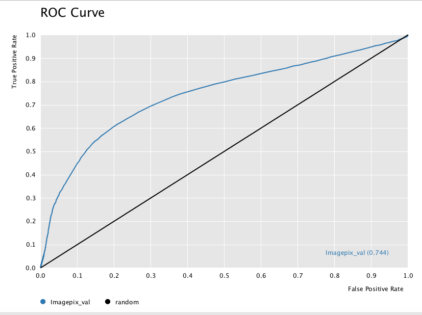
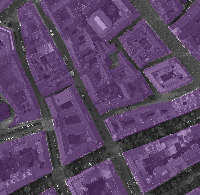

# Exercise 11: Aerial Image Segmentation
Kevin Mader and Javier Montoya  
May 19, 2016  

# Introduction
To practice working with complicated images like those taken from a plane or satellite, we use a set of ground truth and images prepared by Javier. The data are available on the site [http://people.ee.ethz.ch/~maderk/aerial/] or will be automatically downloaded as part of the workflow.

## ROC Curve

We use the ROC curve as the standard metric (feel free to implement F1 score) to evaluate the performance of the system at classifying roads. The simpliest approach ,just converting the image to grayscale probabilities, results in an area under the curve of .744 (not too bad), but this needs to be increased to above 0.9 and ideally 0.99 to be usuable on huge imaging datasets.

## Basic Workflow

The basic workflow is very simple and involves downloading and reading in the image data, processing the image data and then comparing the results to the labels.

The only processing step at the moment is the __Projector__ node which combines the color channels into one and then uses this as the road class probability. Add other steps before or after to improve the segmentation.

The __Labeling to RGB Image__ node takes processed image and combines it with the labels for visual inspection (more helpful than the ROC curve alone). 

[Basic Workflow Download](11-files/AerialImages.zip)

# Exercise

1. Try to add tools developed in the class to improve the segmentation
1. Which areas does the segmentation struggle the most with, why?
1. What strategies might be used to get around these issues?
1. How might this process be optimized better?

